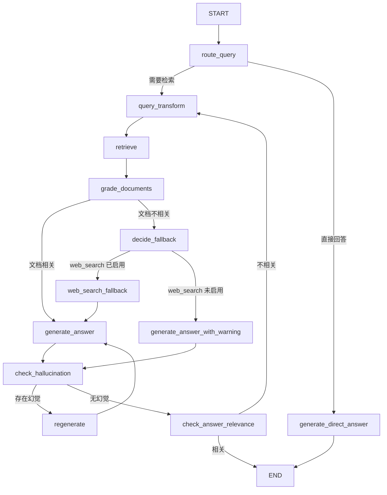
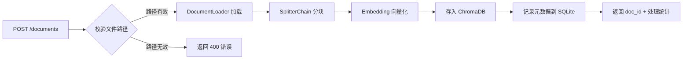
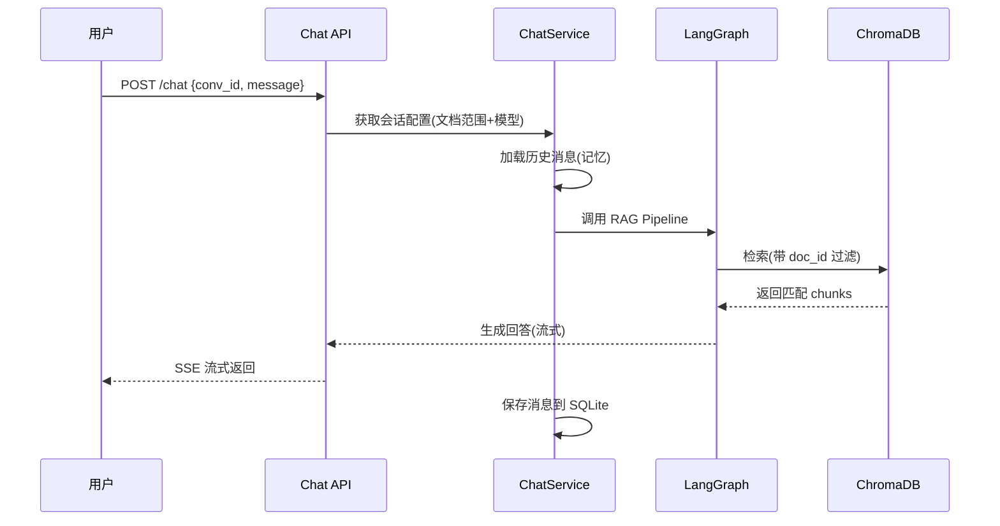

# RAG System v2 迭代方案

> 基于当前 v1 版本的全面分析和前沿 RAG 技术调研，制定本迭代方案。

---

## 一、当前系统分析

### 现状概览

| 模块 | 当前实现 | 主要痛点 |
|------|---------|---------|
| 文档处理 | 仅支持 PDF，`RecursiveCharacterTextSplitter` 固定分块 | 格式受限，分块策略粗糙，无结构感知 |
| 检索 | BM25 + 语义检索，RRF 融合 | 无查询优化，召回率依赖固定 k 值 |
| 重排序 | FlashRank (ms-marco-MiniLM) / Qwen3-Reranker-0.6B | 效果不佳，反而降低质量 |
| 生成 | 简单 QA Prompt，无出处引用 | 不可追溯，缺乏质量保障 |
| 流程 | LangGraph 线性流(query → tool → answer) | 无自修正、无反思机制 |
| 评估 | 无 | 无法量化改进效果 |
| 部署 | CLI 交互 | 不具备服务化能力 |

---

## 二、必须改进项

### 2.1 分块策略升级

#### 2.1.1 多格式文档支持

**新增支持格式：**

| 格式 | 加载器 | 说明 |
|------|--------|------|
| `.pdf` | `PyPDFLoader` (保留) | 已有 |
| `.md` | `UnstructuredMarkdownLoader` | 利用 Markdown 标题层级进行结构化分块 |
| `.txt` | `TextLoader` | 纯文本 |
| `.docx` | `Docx2txtLoader` | Word 文档 |
| `.html` | `BSHTMLLoader` | 网页内容 |
| `.csv` | `CSVLoader` | 表格数据 |

**实现方案：** 创建 `DocumentLoaderFactory`，根据文件后缀自动选择加载器。

#### 2.1.2 高级分块策略

采用**分层分块 + 父文档检索**的组合策略：

**A. Structural Chunking(结构化分块)**

针对 Markdown 等结构化文档，基于标题层级(`#`, `##`, `###`)进行分块，保留文档层次结构。使用 LangChain 的 `MarkdownHeaderTextSplitter`。

```python
# 示例：Markdown 结构化分块
from langchain_text_splitters import MarkdownHeaderTextSplitter

headers_to_split_on = [
    ("#", "Header 1"),
    ("##", "Header 2"),
    ("###", "Header 3"),
]
splitter = MarkdownHeaderTextSplitter(headers_to_split_on=headers_to_split_on)
```

**B. Parent Document Retrieval(父文档检索)**

核心思路：使用**小块检索、大块传入 LLM**。

1. 将文档先分为较大的"父块"(如 2000 tokens)
2. 再将父块细分为"子块"(如 400 tokens)
3. 用子块生成 embedding 并建立索引
4. 检索时匹配子块，但返回对应的父块给 LLM
5. 使用 LangChain 的 `ParentDocumentRetriever`，配合 `InMemoryStore` 或 `RedisStore` 存储父文档

```python
from langchain.retrievers import ParentDocumentRetriever
from langchain.storage import InMemoryStore

parent_splitter = RecursiveCharacterTextSplitter(chunk_size=2000, chunk_overlap=200)
child_splitter = RecursiveCharacterTextSplitter(chunk_size=400, chunk_overlap=50)

store = InMemoryStore()
retriever = ParentDocumentRetriever(
    vectorstore=vectorstore,
    docstore=store,
    child_splitter=child_splitter,
    parent_splitter=parent_splitter,
)
```

**C. Semantic Chunking(语义分块)—— 可选高级方案**

基于句间语义相似度变化进行分块，当连续句子的 embedding 相似度显著下降时创建新块。适合长篇非结构化文档。使用 LangChain 的 `SemanticChunker`。

#### 2.1.3 分块策略选择逻辑

```
文件类型判断
├── .md → MarkdownHeaderTextSplitter (结构化分块)
├── .pdf / .txt / .docx → Parent Document Retrieval (父文档检索)
└── 所有格式 → 兜底使用 RecursiveCharacterTextSplitter
```

---

### 2.2 Rerank 重排序重新设计

#### 2.2.1 问题诊断

v1 版本重排序效果变差的可能原因：

1. **模型选择问题**：`ms-marco-MiniLM-L-12-v2` 是英文模型，对中文支持较差
2. **Qwen3-Reranker-0.6B 参数量过小**：0.6B 的模型容量不足以处理复杂的中英文混合场景
3. **top_n 设置不当**：融合后约 60 个文档直接重排到 7 个，过于激进
4. **缺少阈值过滤**：低分文档也被保留，引入噪声

#### 2.2.2 Cross-Encoder 模型调研与推荐

| 模型 | 参数量 | 多语言 | MTEB 表现 | 推荐度 | 备注 |
|------|--------|--------|-----------|--------|------|
| `BAAI/bge-reranker-v2-m3` | ~600M | ✅ 强 | 92-96% | ⭐⭐⭐⭐⭐ | **首选。** 开源最佳性价比，多语言强，社区广泛使用 |
| `BAAI/bge-reranker-v2-gemma` | ~2B | ✅ | 更高 | ⭐⭐⭐⭐ | 效果更好但资源消耗大，适合 GPU 充裕场景 |
| `jinaai/jina-reranker-v2-base-multilingual` | ~278M | ✅ 100+ 语言 | 良好 | ⭐⭐⭐⭐ | 轻量高速，15x 快于 bge-v2-m3 |
| `Cohere Rerank 3/4` | 闭源 | ✅ 100+ 语言 | 顶尖 | ⭐⭐⭐ | API 调用，效果最好但有成本 |
| `ms-marco-MiniLM-L-12-v2` | ~33M | ❌ 仅英文 | 85-90% | ⭐⭐ | 当前使用，不适合中文 |

**推荐方案：** 使用 `BAAI/bge-reranker-v2-m3` 替代当前模型。

#### 2.2.3 重排序改进策略

```python
# 改进方案
class ImprovedReranker:
    # 1. 使用 bge-reranker-v2-m3
    # 2. 引入分数阈值过滤(score_threshold=0.3)
    # 3. 动态 top_n：根据分数分布自动确定截断点
    # 4. 保留 relevance_score 元数据，供下游使用
```

关键改进点：
- 替换模型为 `bge-reranker-v2-m3`
- 增加 `score_threshold` 参数，过滤低相关性文档
- 在返回的 Document 的 metadata 中附加 `relevance_score`
- 保留 SimpleCompressor 作为 fallback

---

### 2.3 评估框架集成

#### 2.3.1 框架调研对比

| 框架 | 特点 | 是否需要标注数据 | 与 LangChain 集成 | 推荐度 |
|------|------|----------------|-------------------|--------|
| **RAGAS** | 轻量，LLM-as-Judge，4 个核心指标 | 部分指标不需要 | ✅ 原生支持 | ⭐⭐⭐⭐⭐ |
| **ARES** | 合成数据 + 训练 Judge LLM + PPI | 少量标注 | 需适配 | ⭐⭐⭐ |
| **DeepEval** | 类似 RAGAS，更多自定义指标 | 不需要 | ✅ | ⭐⭐⭐⭐ |
| **LangSmith Eval** | 官方评估，与 LangSmith 深度集成 | 可选 | ✅ 官方 | ⭐⭐⭐⭐ |

**推荐方案：primaryStage 使用 RAGAS，已有 LangSmith 追踪可结合使用。**

#### 2.3.2 RAGAS 核心评估指标

| 指标 | 评估对象 | 说明 |
|------|---------|------|
| **Faithfulness** | 生成质量 | 答案是否忠实于检索到的上下文(减少幻觉) |
| **Answer Relevancy** | 生成质量 | 答案与问题的相关性 |
| **Context Precision** | 检索质量 | 检索上下文的信噪比 |
| **Context Recall** | 检索质量 | 是否检索到了足够的相关信息 |

#### 2.3.3 集成方案

```python
from ragas import evaluate
from ragas.metrics import faithfulness, answer_relevancy, context_precision, context_recall

# 构建评估数据集(QA Pairs + Ground Truth)
eval_dataset = {
    "question": [...],
    "answer": [...],
    "contexts": [...],
    "ground_truth": [...]  # 人工标注
}

result = evaluate(
    dataset=eval_dataset,
    metrics=[faithfulness, answer_relevancy, context_precision, context_recall],
)
```

**评估工作流：**
1. 手动构建 20-50 个 QA 评估集(含 ground_truth)
2. 运行 RAG Pipeline 生成 answer 和 contexts
3. 使用 RAGAS 计算指标
4. 对比不同配置(分块策略、重排序、查询优化等)的效果差异
5. 可通过 LangSmith 追踪查看每次运行的详细日志

---

## 三、非必要改进项

### 3.1 查询转换(Pre-Retrieval)

#### 3.1.1 Multi-Query(多查询生成)

使用 LLM 将用户原始查询改写为 3-5 个不同角度的子查询，对每个子查询独立检索，最终合并结果(使用 RRF 融合)。

```python
from langchain.retrievers import MultiQueryRetriever

multi_query_retriever = MultiQueryRetriever.from_llm(
    retriever=base_retriever,
    llm=llm,
)
```

#### 3.1.2 HyDE(假设性文档嵌入)

让 LLM 为查询生成一个"假设性回答文档"，用该文档的 embedding 进行检索，解决 query-document 语义鸿沟问题。

```python
from langchain.chains import HypotheticalDocumentEmbedder

hyde_embeddings = HypotheticalDocumentEmbedder.from_llm(
    llm=llm,
    base_embeddings=embeddings,
    prompt_key="web_search",  # 或自定义 prompt
)
```

#### 3.1.3 推荐组合策略

```
用户查询
  ├── Multi-Query (生成 3 个变体查询)
  │   ├── 变体 1 → Hybrid Retriever → 结果集 1
  │   ├── 变体 2 → Hybrid Retriever → 结果集 2
  │   └── 变体 3 → Hybrid Retriever → 结果集 3
  │
  └── RRF 融合所有结果 → Reranker → 最终 top_k 文档
```

> [!TIP]
> HyDE 会引入额外 LLM 调用延迟，建议作为可选开关。Multi-Query 性价比更高，建议默认启用。

---

### 3.2 出处引用(Citation)

#### 3.2.1 实现方案

在生成阶段的 Prompt 中明确要求 LLM 标注出处：

```python
ANSWER_PROMPT_WITH_CITATION = """
你是一个智能问答助手。请基于以下检索到的上下文回答用户问题。

要求：
1. 回答必须基于提供的上下文，不得编造信息
2. 在回答中引用来源，格式为 [来源: 文件名, 页码/段落]
3. 如果上下文不足以回答，请明确说明

上下文：
{context}

问题：{question}

请回答(务必标注出处)：
"""
```

关键实现：
- 在 `retrieve` 工具返回时，为每个文档附带编号和来源信息
- 在传入 context 时，对每个文档片段标注 `[文档 {i}: {source}, {page}]`
- Prompt 明确指示 LLM 引用这些标注

---

### 3.3 LangGraph 流程升级

#### 3.3.1 引入 CRAG(Corrective RAG)+ Self-Reflection

当前线性流程：
```
START → generate_query → tool_node → generate_answer → END
```

升级后带反思的流程：



> [!IMPORTANT]
> `web_search_fallback` 设计为**可配置开关**(通过 `.env` 中 `WEB_SEARCH_ENABLED=false` 控制，默认关闭)。个人知识库的内容往往是私有的，网络搜索不一定能补充有效信息。关闭时，文档不相关将直接进入生成阶段，并附带"当前知识库未找到高相关内容"的提示。

#### 3.3.2 新增节点说明

| 节点 | 功能 | 说明 |
|------|------|------|
| `route_query` | 查询路由 | 判断是否需要检索(LLM 分类) |
| `query_transform` | 查询转换 | Multi-Query / HyDE |
| `grade_documents` | 文档评分 | LLM 判断检索文档是否与问题相关 |
| `decide_fallback` | 兜底策略路由 | 根据 `web_search_enabled` 配置决定走网络搜索还是直接生成 |
| `web_search_fallback` | 网络搜索兜底 | **可选开关(默认关闭)。** 启用后，当文档不相关时使用 Tavily 等进行网络搜索 |
| `generate_answer_with_warning` | 带提示生成 | 网络搜索关闭时，告知用户知识库未找到高相关内容，基于已有信息尽力回答 |
| `check_hallucination` | 幻觉检测 | LLM 评估答案是否基于上下文 |
| `check_answer_relevance` | 答案相关性检查 | LLM 评估答案是否回答了问题 |
| `regenerate` | 重新生成 | 根据反馈重新生成答案(设最大重试次数) |

#### 3.3.3 State 升级

```python
class OverallState(MessagesState):
    user_question: str
    transformed_queries: list[str]  # 转换后的查询列表
    retrieved_docs: list[Document]  # 检索到的文档
    graded_docs: list[Document]    # 评分通过的文档
    generation: str                # 生成的答案
    retry_count: int               # 重试次数
    web_search_enabled: bool       # 网络搜索开关(从配置读取，默认 False)
    citations: list[dict]          # 引用信息
```

---

### 3.4 FastAPI 服务化 -- 个人知识库系统

> [!IMPORTANT]
> 本项目定位升级为 **个人知识库系统(Personal Knowledge Base)**，围绕 **文档管理** 和 **智能对话** 两大核心能力进行服务化改造。服务化是最高优先级，已调整至 Phase 1。

#### 3.4.1 核心功能定义

**A. 文档管理**

| 功能 | 说明 |
|------|------|
| 上传 | 提供本地 `file_path`，后端读取文件内容(非真实文件上传) |
| 处理 | 使用 DocumentLoader 加载 + SplitterChain 分块(chunking) |
| 嵌入 | 分块后通过 Embedding 模型生成向量并存入 ChromaDB |
| 删除 | 按文档 ID 删除向量数据库中对应的所有 chunks |
| 更新 | 删除旧版本 chunks 后重新执行 处理 → 嵌入 流程 |

文档的完整生命周期：`上传(提交路径) → 处理(加载+分块) → 嵌入(向量化存储) → [更新/删除]`

**B. 智能对话**

| 功能 | 说明 |
|------|------|
| 文档选择 | 用户在对话时指定一组文档作为知识来源，检索仅在这些文档范围内进行 |
| 模型选择 | 支持在对话中指定使用的 LLM 模型(如 gpt-4o、qwen-plus 等) |
| 动态调整 | 同一个对话会话内，用户可随时修改选中的文档范围，无需新建对话 |
| 记忆功能 | 对话具备上下文记忆，支持多轮连续问答 |
| 流式响应 | 使用 SSE(Server-Sent Events) 实现流式输出 |

**C. 会话管理**

| 功能 | 说明 |
|------|------|
| 创建会话 | 创建对话会话，同时指定文档范围和 LLM 模型 |
| 查询会话 | 获取会话列表或单个会话的详细信息(含消息历史) |
| 更新会话 | 修改会话的文档范围、模型选择等配置 |
| 删除会话 | 删除会话及其所有消息记录 |

#### 3.4.2 项目结构规划

```
RAG/
├── app/
│   ├── __init__.py
│   ├── main.py              # FastAPI 入口，生命周期管理
│   ├── config.py             # 配置管理 (Pydantic Settings)
│   ├── dependencies.py       # 依赖注入(单例管理：Embeddings、ChromaDB Client 等)
│   ├── core/
│   │   ├── __init__.py
│   │   ├── document_loader.py    # 文档加载器工厂
│   │   ├── chunking.py           # 分块策略 (SplitterChain)
│   │   ├── embeddings.py         # Embedding 模型管理
│   │   ├── retriever.py          # 检索器(混合检索、压缩检索)
│   │   ├── reranker.py           # 重排序器
│   │   └── graph.py              # LangGraph 流程定义(RAG Pipeline)
│   ├── api/
│   │   ├── __init__.py
│   │   ├── v1/
│   │   │   ├── __init__.py
│   │   │   ├── documents.py      # 文档管理接口(上传/处理/嵌入/删除/更新)
│   │   │   ├── chat.py           # 对话接口(SSE 流式问答)
│   │   │   ├── conversations.py  # 会话管理接口(CRUD)
│   │   │   ├── collections.py    # 集合管理接口
│   │   │   ├── system.py         # 系统信息接口(健康检查、支持的模型/格式)
│   │   │   └── evaluation.py     # 评估接口
│   │   └── router.py             # 路由注册
│   ├── models/
│   │   ├── __init__.py
│   │   ├── schemas.py            # Pydantic 请求/响应模型
│   │   ├── state.py              # LangGraph State 定义
│   │   └── database.py           # SQLite 模型(会话、消息持久化)
│   ├── services/
│   │   ├── __init__.py
│   │   ├── document_service.py   # 文档管理业务逻辑
│   │   ├── chat_service.py       # 对话业务逻辑(调用 LangGraph)
│   │   └── conversation_service.py # 会话管理业务逻辑
│   └── utils/
│       ├── __init__.py
│       └── preprocessing.py      # 文本预处理
├── data/
│   └── knowledge_base.db        # SQLite 数据库(会话+消息持久化)
├── evaluation/
│   ├── __init__.py
│   ├── evaluator.py              # RAGAS 评估器
│   ├── datasets/                 # 评估数据集
│   └── results/                  # 评估结果
├── tests/
│   ├── __init__.py
│   ├── test_chunking.py
│   ├── test_retriever.py
│   └── test_api.py
├── .env
├── requirements.txt
├── API_Documentation.md          # 详细 API 文档
├── Dockerfile
└── README.md
```

> [!TIP]
> 新增 `services/` 层将业务逻辑从 API 路由中解耦。`models/database.py` 使用 SQLite + SQLAlchemy 管理会话和消息的持久化，实现对话记忆功能。

#### 3.4.3 API 概览

完整 API 文档见 [API_Documentation.md](./API_Documentation.md)。

| 模块 | 方法 | 路径 | 功能 |
|------|------|------|------|
| **文档管理** | `POST` | `/api/v1/documents` | 提交文档路径，执行加载+分块+嵌入 |
| | `GET` | `/api/v1/documents` | 获取已处理的文档列表 |
| | `GET` | `/api/v1/documents/{doc_id}` | 获取单个文档详情 |
| | `PUT` | `/api/v1/documents/{doc_id}` | 更新文档(重新处理+嵌入) |
| | `DELETE` | `/api/v1/documents/{doc_id}` | 删除文档及其所有 chunks |
| **会话管理** | `POST` | `/api/v1/conversations` | 创建会话(指定文档+模型) |
| | `GET` | `/api/v1/conversations` | 获取会话列表 |
| | `GET` | `/api/v1/conversations/{conv_id}` | 获取会话详情(含消息历史) |
| | `PATCH` | `/api/v1/conversations/{conv_id}` | 更新会话配置(文档范围/模型) |
| | `DELETE` | `/api/v1/conversations/{conv_id}` | 删除会话 |
| **对话** | `POST` | `/api/v1/chat` | 发送消息并获取 RAG 回答(SSE 流式) |
| **集合** | `GET` | `/api/v1/collections` | 获取集合列表 |
| | `POST` | `/api/v1/collections` | 创建集合 |
| | `DELETE` | `/api/v1/collections/{name}` | 删除集合 |
| **系统** | `GET` | `/api/v1/system/health` | 健康检查 |
| | `GET` | `/api/v1/system/supported-formats` | 获取支持的文件格式列表 |
| | `GET` | `/api/v1/system/models` | 获取可用的 LLM 模型列表 |
| **评估** | `POST` | `/api/v1/evaluate` | 运行 RAGAS 评估 |
| | `GET` | `/api/v1/evaluate/results` | 获取评估结果 |

#### 3.4.4 关键设计决策

**文档管理流程：**



**对话流程(含文档筛选)：**



**文档选择与检索过滤机制：**

在 ChromaDB 中，每个 chunk 的 metadata 包含 `doc_id` 字段。对话时根据会话绑定的 `document_ids` 列表，在检索阶段通过 ChromaDB 的 `where` 过滤条件实现文档范围限定：

```python
# 带文档过滤的检索
vector_store.similarity_search(
    query=query,
    k=k,
    filter={"doc_id": {"$in": selected_doc_ids}}
)
```

**记忆机制：**

- 使用 SQLite 持久化消息历史，每条消息关联 `conversation_id`
- 对话时从数据库加载该会话的历史消息，拼接为 LangChain `Messages` 格式
- 支持配置最大记忆轮数(`max_history_turns`)，避免 context 超限

---

## 四、额外建议(前沿技术)

### 4.1 Contextual Retrieval(上下文嵌入)

Anthropic 提出的技术：在分块嵌入前，使用 LLM 为每个块生成一段"上下文前缀"(描述该块在文档中的位置和主题)，将前缀与原文拼接后再进行嵌入。可显著提升检索质量(实验显示 Context Precision 提升 ~49%)。

### 4.2 Knowledge Graph RAG (GraphRAG)

将文档内容构建为知识图谱，结合图检索和向量检索。微软 GraphRAG 项目是代表性实现。适合需要多跳推理的场景，如"A 和 B 之间的关系是什么？"。

> [!NOTE]
> GraphRAG 实现复杂度高，建议作为 v3 排期内容。

### 4.3 Late Chunking

先将全文喂入长上下文 Embedding 模型生成 Token 级向量，再分块。每个 Token 的向量已包含全文上下文信息，解决传统分块后上下文丢失的问题。需要支持长上下文的 Embedding 模型(如 Jina Embeddings v2)。

### 4.4 Embedding 模型升级建议

当前较优的中英文 Embedding 模型：

| 模型 | 维度 | 上下文长度 | 特点 |
|------|------|-----------|------|
| `BAAI/bge-m3` | 1024 | 8192 | 多语言，支持稠密 + 稀疏 + ColBERT |
| `jinaai/jina-embeddings-v3` | 1024 | 8192 | 多语言，性能强 |
| `text-embedding-3-large` (OpenAI) | 3072 | 8191 | 闭源 API，效果好 |

---

## 五、迭代路线图

### Phase 1：服务化 + 核心功能(优先级最高)

> 目标：将 CLI 工具升级为 FastAPI 服务，实现文档管理和智能对话两大核心功能。

- [ ] 使用 FastAPI 构建 RESTful API 框架，配置生命周期管理
- [ ] 新增 `services/` 业务逻辑层，解耦 API 路由与核心逻辑
- [ ] 实现 SQLite + SQLAlchemy 数据层(会话、消息、文档元数据持久化)
- [ ] 实现文档管理 API：上传(提供路径) → 处理 → 嵌入 → 删除 → 更新
- [ ] 实现会话管理 API：创建/查询/更新/删除对话会话
- [ ] 实现对话 API：基于 LangGraph 的 RAG 问答，支持 SSE 流式响应
- [ ] 实现文档选择过滤(ChromaDB `where` 条件) + 动态调整文档范围
- [ ] 实现对话记忆功能(SQLite 持久化历史消息 + 可配置最大轮数)
- [ ] 实现系统信息 API(健康检查、支持格式、可用模型)
- [ ] 实现集合管理 API

### Phase 2：核心能力改进

> 目标：改进已有的分块、检索、重排序等核心 RAG 能力。

- [ ] 实现分层分块 + 父文档检索
- [ ] 替换 Reranker 为 `bge-reranker-v2-m3`，增加阈值过滤
- [ ] 集成 RAGAS 评估框架，实现评估 API

### Phase 3：智能化升级

> 目标：提升检索和生成质量。

- [ ] 实现 Multi-Query 查询转换
- [ ] 实现 HyDE(可选开关)
- [ ] 升级 LangGraph 流程：加入文档评分、幻觉检测、答案相关性检查(CRAG)
- [ ] 生成阶段加入出处引用

### Phase 4：进阶探索(v3)

- [ ] Contextual Retrieval(上下文嵌入)
- [ ] GraphRAG(知识图谱 + RAG)
- [ ] Late Chunking
- [ ] Embedding 模型升级
- [ ] Dockerfile 容器化部署

---

## 六、技术栈总结

| 类别 | 技术选型 |
|------|---------|
| 核心框架 | LangChain + LangGraph |
| API 框架 | FastAPI + Uvicorn |
| 向量数据库 | ChromaDB |
| 关系数据库 | SQLite + SQLAlchemy(会话/消息/文档元数据持久化) |
| 流式响应 | SSE (Server-Sent Events) |
| 重排序 | `BAAI/bge-reranker-v2-m3` |
| 评估 | RAGAS + LangSmith |
| 部署 | Docker |
| 查询优化 | Multi-Query + HyDE (可选) |
| 分块 | MarkdownHeaderTextSplitter + SplitterChain + RecursiveCharacterTextSplitter |
